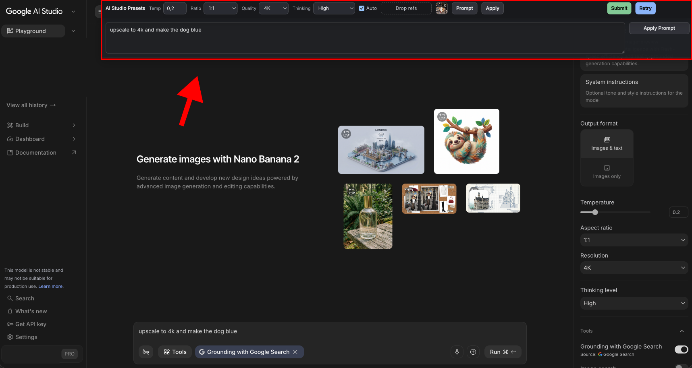

# Google AI Studio Image Presets

A local ChatGPT Atlas / Chromium extension that saves and auto-applies Google AI Studio image generation settings.

It was created on **May 8, 2026** for the Google AI Studio image playground UI shown below, specifically the **Nano Banana 2** image generation experience in **ChatGPT Atlas**. It should also work in other Chromium browsers that support unpacked extensions. If Google changes the AI Studio interface, some selectors may need updates.

## Why This Exists

When generating images in Google AI Studio, starting a new chat can reset the same controls over and over: temperature, aspect ratio, resolution, thinking level, prompt, and reference images.

This extension adds a small control bar directly on `aistudio.google.com` so repeated image attempts are faster. Set the values once, keep your prompt and refs nearby, then submit or retry without rebuilding the setup every time.

## Features

- Save and auto-apply temperature, aspect ratio, resolution, and thinking level.
- Always applies **Images only** output mode.
- Save a prompt in a collapsible panel.
- Mirror the saved prompt into the AI Studio prompt field while typing.
- Store reference images in a local tray.
- Submit from the top bar.
- Retry from the top bar: opens a fresh chat, reapplies settings, restores the prompt, attempts to attach reference images, and submits.
- Plays a short audio notification when a generation appears to be complete.
- Uses a full-width top bar and pushes the AI Studio page down instead of covering it.
- Runs only on `https://aistudio.google.com/*`.
- No backend, no analytics, no tracking.

## Search Terms This Helps With

If you found this while searching for any of these, you are probably in the right place:

- google ai studio save settings
- google ai studio presets
- google ai studio default settings
- google ai studio image generation settings
- google ai studio aspect ratio reset
- google ai studio temperature preset
- google ai studio retry image generation
- google ai studio keep prompt
- google ai studio reference images
- ai studio auto settings

## Compatibility

This was built and tested for **ChatGPT Atlas**. It should also work in Chromium-based browsers that support unpacked extensions, including:

- ChatGPT Atlas
- Google Chrome
- Microsoft Edge
- Brave

Tested on **macOS with ChatGPT Atlas**. It is not intentionally Mac-only, but the install notes below are written from a Mac/Atlas/Chromium perspective.

## Installation

1. Download this repository.
2. Unzip it if needed.
3. Open your browser's extensions page:
   - ChatGPT Atlas: `atlas://extensions`
   - Chrome: `chrome://extensions`
   - Edge: `edge://extensions`
   - Brave: `brave://extensions`
4. Enable **Developer mode**.
5. Click **Load unpacked**.
6. Select the extension folder containing `manifest.json`.
7. Open or reload `https://aistudio.google.com/`.

You should see the **AI Studio Presets** bar at the top of AI Studio.

## Notes About Reference Images

The reference image tray stores images locally in your browser. Retry attempts to reattach them automatically by using the browser's file/drop APIs.

Browsers and websites intentionally restrict programmatic file uploads for security, so this may need tweaks if Google changes AI Studio's upload behavior.

## Privacy

Everything is local:

- settings are stored in browser extension storage
- reference images are stored locally in IndexedDB
- no remote server is used
- no analytics are collected

## Development

After editing the local extension:

1. Open your browser's extensions page.
2. Click reload on **AI Studio Presets**.
3. Reload Google AI Studio.

## Disclaimer

This project is not affiliated with Google, Google AI Studio, OpenAI, or ChatGPT Atlas.

Google AI Studio can change its interface at any time. This extension was built against the Nano Banana 2 image generation UI available on May 8, 2026.
